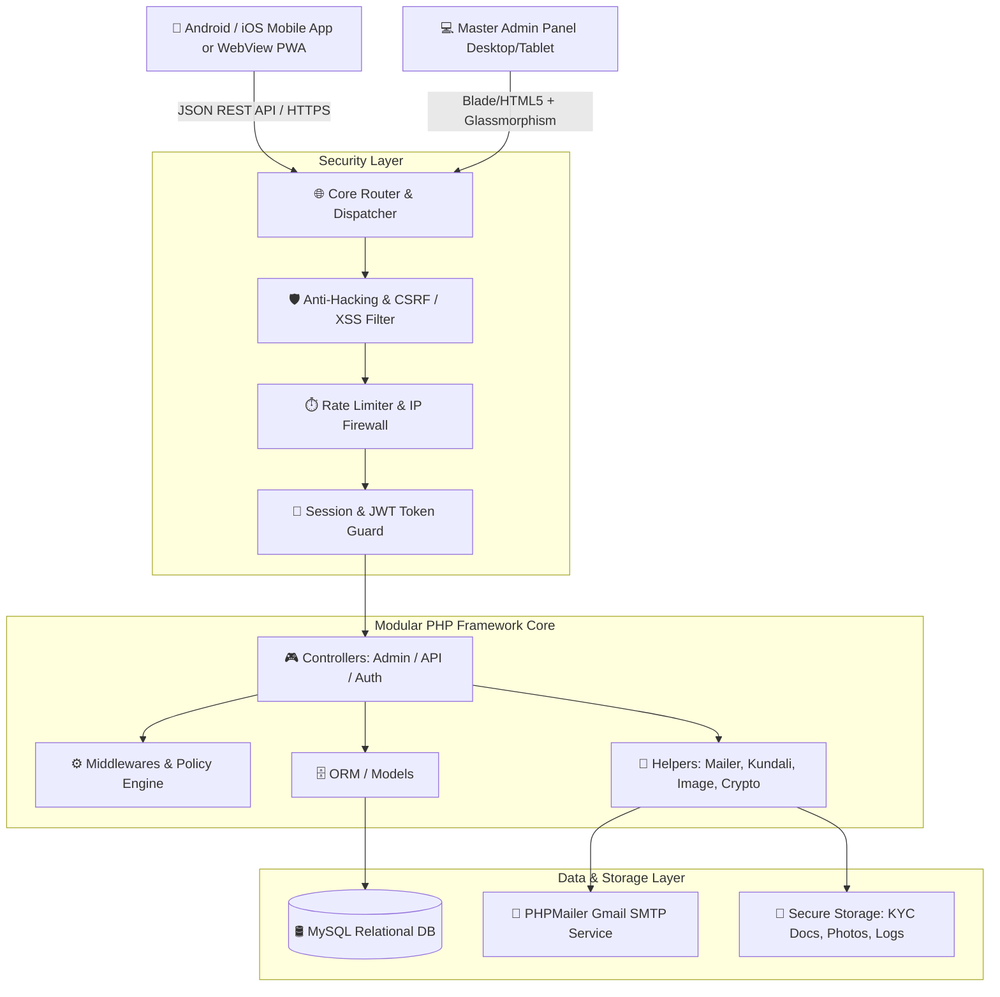

# 💍 Dheeraja Matrimony — Complete System Blueprint

> **A Next-Generation, Enterprise-Grade Matrimony Platform with Master Admin Control, Mobile-First App API, PHPMailer Alert Engine, and Royal Indian Aesthetics.**

---

## 🌟 Executive Summary

**Dheeraja Matrimony** is engineered as a high-trust, culturally refined matrimonial matchmaking ecosystem designed specifically for the modern Indian landscape. It combines:
1. **Master Admin Panel**: Unrestricted super-admin control, KYC verification, VIP grant engine, anti-fraud and session-level security.
2. **Mobile App Architecture**: API-first backend powering native mobile apps (Android/iOS) and responsive Mobile Webview/PWA views.
3. **Smart Matchmaking Engine**: Multi-parameter algorithms matching caste, gotra, manglik status, horoscopes (Kundali), location, education, and lifestyle.
4. **Subscription & Launch Strategy**: Built-in tiered monetization (Silver, Gold, VIP Pro) paired with an automated **"Early Bird Free VIP Launch Mode"** to acquire initial active users and achieve viral product-market fit.
5. **Real-time Alert & Mailer Engine**: High-deliverability notification suite powered by PHPMailer (Gmail SMTP configured) alerting both Admin and Users.
6. **Royal Aesthetic Design Language**: A blend of **Royal White, Crimson Maroon (`#6B1D2F`), and Imperial Gold (`#D4AF37`)**, enhanced with subtle **Liquid Glass (Glassmorphism)** and glowing micro-interactions.

---

## 🏛️ System High-Level Architecture

---

## 🎨 Theme & Visual Identity

The visual language reflects the prestige, sanctity, and warmth of traditional Indian matchmaking while maintaining state-of-the-art digital elegance.

| Element | Specification | Hex / Value | Usage |
| :--- | :--- | :--- | :--- |
| **Primary Base** | Royal Pearl White | `#FDFBF7` / `#FFFFFF` | Backgrounds, clean card surfaces |
| **Royal Maroon** | Deep Crimson Maroon | `#6B1D2F` / `#800020` | Headers, brand icons, primary buttons, badges |
| **Imperial Gold** | Antique Gold Accent | `#D4AF37` / `#F3C044` | Borders, glowing badges, VIP indicators, buttons |
| **Liquid Glass** | Glassmorphism | `rgba(255, 255, 255, 0.75)` + `backdrop-blur(16px)` | Floating headers, cards, modals, navigation bars |
| **Text Dark** | Royal Obsidian | `#1A1A1A` / `#2D2D2D` | Primary headings and text |
| **Text Muted** | Warm Slate | `#666666` / `#8C8C8C` | Sub-labels, secondary details |
| **Shadows & Glow**| Gold & Maroon Glow | `0 8px 32px 0 rgba(212, 175, 55, 0.2)` | Active states, VIP cards, primary CTAs |

---

## 📂 Documentation Index

All architectural guidelines and implementation blueprints are organized in dedicated documents:

1. [01. Architecture & Directory Flow](docs/01_ARCHITECTURE_AND_STRUCTURE.md) — MVC Framework, router, controllers, helpers, and file organization.
2. [02. Database Schema Design](docs/02_DATABASE_SCHEMA.md) — 18+ Relational MySQL tables with constraints and foreign keys.
3. [03. Mobile App REST API Specification](docs/03_REST_API_SPECIFICATION.md) — Mobile endpoints for authentication, profile browsing, chat, and match feed.
4. [04. Master Admin Panel Specification](docs/04_MASTER_ADMIN_PANEL.md) — Granular control, user management, VIP grant system, anti-hacking security.
5. [05. Alert & PHPMailer Notification Engine](docs/05_ALERT_AND_MAILER_SYSTEM.md) — Gmail SMTP setup, trigger matrix, HTML email templates.
6. [06. Theme, UI & Glassmorphism Design System](docs/06_THEME_AND_UI_DESIGN_SYSTEM.md) — Design tokens, Tailwind CSS configuration, and UI component standards.
7. [07. Launch & Monetization Strategy](docs/07_LAUNCH_AND_PROMOTION_STRATEGY.md) — Launch promotion, free VIP roll-out, countdowns, and conversion pathways.

---

## 🚀 Key Feature Matrix

### 👤 User Module (App & API First)
- **App Shell Experience**: 100% mobile-optimized touch interactions (swiping, bottom sheets, sticky tabs).
- **Profile Registration**: Multi-step intuitive wizard (Personal, Education/Career, Family Background, Kundali/Horoscope, Partner Expectations).
- **Matchmaking Engine**: Compatibility score based on user criteria (Age, Height, Gotra, Location, Income, Lifestyle).
- **Express Interest & Shortlisting**: Send interest, accept/decline requests, instant shortlisted bookmarks.
- **Privacy & Photo Protection**: Blur photo mode, photo request approval, profile visibility toggles.
- **Direct Messaging**: In-app secure chat between connected profiles.
- **Kundali Matching (Gun Milan)**: Basic Guna scoring and Manglik dosha alerts.

### 🛡️ Master Admin Panel
- **Executive Dashboard**: Real-time stats (Total Users, Active VIPs, Verification Pending, Today's Matches, Revenue).
- **Complete CRUD Separation**: Separate dedicated Add, Edit, Delete, View, and Manage pages for every single entity.
- **VIP & Pro Plan Granting Engine**: Admin can grant, revoke, upgrade, or extend any plan for any user for any number of days with 1 click.
- **KYC & Photo Moderation**: Government ID proof verification (Aadhaar, Passport, Driving License) and photo approval/rejection with custom feedback.
- **Anti-Hacking Security**:
  - CSRF token validation on all POST/PUT/DELETE requests.
  - SQL injection protection via strict PDO Prepared Statements.
  - XSS filtering on all inputs and outputs.
  - Session timeout with automatic lock screen (configurable 15/30 mins).
  - Admin activity audit log (every admin action is permanently logged with IP and timestamp).
  - Dynamic IP Blacklisting / Whitelisting.
- **Promotion & Banner Management**: Create announcement banners, discount codes, and launch alert badges.

---

## 🔒 Security Standards
- **Passwords**: `bcrypt` (cost factor 12) hashing.
- **Authentication**: JWT tokens for Mobile REST APIs; hardened HTTP-only encrypted cookies for Admin Panel.
- **File Uploads**: MIME-type sniffing, sanitization, random filename generation, and size limits (max 5MB, JPG/PNG/WebP only).
- **Rate Limiting**: 60 requests per minute on API endpoints; 5 failed login attempts trigger 15-minute lock.
