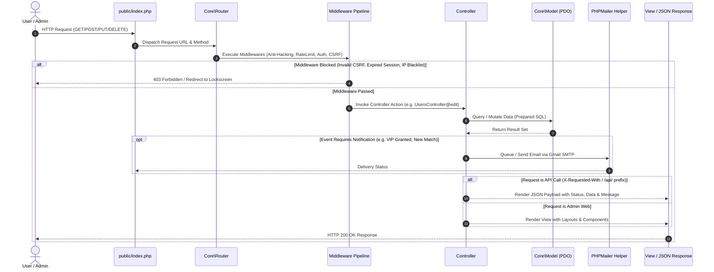

# 🏗️ Module 01: System Architecture & Framework Flow

## 📌 Architectural Overview

The backend is constructed on a **custom modular PHP MVC Framework** inspired by Laravel's proven paradigms, providing:
1. Complete separation of concerns: Models, Views, Controllers, Middlewares, and Helpers.
2. Distinct routing channels for **Master Admin Web Interface** (`routes/admin.php`), **Mobile App REST APIs** (`routes/api.php`), and **Public/Web Shell** (`routes/web.php`).
3. Dedicated independent views and controller actions for every admin entity: `list`, `add`, `edit`, `delete`, and `view/manage`.
4. Extensible middleware pipeline for authentication, session timeout, anti-hacking filtering, CORS, and rate limiting.

---

## 🗂️ Complete Directory Structure

```text
Dheeraja-Matrimony/
├── app/
│   ├── Config/                     # System configuration files
│   │   ├── app.php                 # App settings, environment, debug mode
│   │   ├── database.php            # MySQL PDO credentials & pool settings
│   │   ├── mail.php                # PHPMailer & Gmail SMTP settings
│   │   └── security.php            # CSRF tokens, session timeouts, IP whitelist
│   │
│   ├── Core/                       # Custom Lightweight MVC Core Engine
│   │   ├── Router.php              # Regex-based HTTP Router with middleware support
│   │   ├── Controller.php          # Base Controller with JSON & view renderers
│   │   ├── Model.php               # Base Active-Record/Data-Mapper Model with PDO
│   │   ├── Request.php             # HTTP Request parser, sanitization, files
│   │   ├── Response.php            # HTTP Response formatter (JSON, Redirect, HTML)
│   │   ├── Database.php            # Singleton PDO Connection manager
│   │   ├── Session.php             # Hardened Session & Flash message handler
│   │   └── Validator.php           # Flexible input validation engine
│   │
│   ├── Controllers/
│   │   ├── Admin/                  # MASTER ADMIN PANEL CONTROLLERS
│   │   │   ├── AuthController.php          # Admin Login, Logout, 2FA
│   │   │   ├── DashboardController.php     # Metrics, Charts, Overview
│   │   │   ├── UsersController.php         # User Add, Edit, Delete, Manage, Status
│   │   │   ├── KycController.php           # ID verification, photo approval
│   │   │   ├── SubscriptionsController.php # Plan config, free VIP grant engine
│   │   │   ├── MatchesController.php       # Manual matchmaker, match stats
│   │   │   ├── PromotionsController.php    # Banners, coupon codes, alerts
│   │   │   ├── SecurityController.php      # IP blacklist, audit logs, session settings
│   │   │   ├── NotificationsController.php # Broadcast mail/push, alert history
│   │   │   └── SettingsController.php      # General app branding, email config
│   │   │
│   │   └── Api/                    # MOBILE APP REST API CONTROLLERS
│   │       ├── AuthController.php          # App Signup, Login, OTP, Forgot Password
│   │       ├── ProfileController.php       # Complete Profile CRUD, Gallery, Kundali
│   │       ├── MatchController.php         # Matching Algorithm, Recommendations, Feed
│   │       ├── SearchController.php        # Advanced Filter (Caste, Age, City, Income)
│   │       ├── InterestController.php      # Send/Accept/Decline Express Interest
│   │       ├── ShortlistController.php     # Bookmarking & Shortlisting
│   │       ├── ChatController.php          # In-app messaging & Conversation threads
│   │       ├── PlanController.php          # Current plan info, Free VIP activation
│   │       └── NotificationController.php  # User in-app notifications
│   │
│   ├── Models/                     # DATABASE MODELS (PDO-Powered)
│   │   ├── User.php                # Account credentials, status, roles
│   │   ├── Profile.php             # Bio, education, occupation, physical traits
│   │   ├── FamilyDetail.php        # Family values, parents, siblings
│   │   ├── Astrology.php           # Rashi, Nakshatra, Gotra, Manglik, Kundali
│   │   ├── Preference.php          # Desired partner traits
│   │   ├── UserPhoto.php           # Gallery pictures & approval states
│   │   ├── KycDocument.php         # Government IDs & verification statuses
│   │   ├── Interest.php            # Express interest requests & states
│   │   ├── Shortlist.php           # Saved profiles
│   │   ├── ChatMessage.php         # Messages between matched members
│   │   ├── SubscriptionPlan.php    # Defined packages (Free, Gold, VIP Pro)
│   │   ├── UserSubscription.php    # Active user plans, expiry, grant logs
│   │   ├── Promotion.php           # Banners, discount codes, announcement popups
│   │   ├── AdminLog.php            # Security audit trail of all admin actions
│   │   └── BlockedIp.php           # IP firewall blacklist table
│   │
│   ├── Middlewares/                # HTTP PIPELINE GUARDS
│   │   ├── AuthMiddleware.php      # Mobile API JWT Bearer token validator
│   │   ├── AdminAuthMiddleware.php # Admin session authentication & permission check
│   │   ├── SessionTimeoutMiddleware.php # Automatic Admin lock on inactivity (15 mins)
│   │   ├── AntiHackingMiddleware.php    # XSS sanitization, SQLi detection, payload sanitizing
│   │   ├── CsrfMiddleware.php      # Token validation for state-altering Admin forms
│   │   ├── RateLimitMiddleware.php # Per-IP / Per-User rate throttle (60 req/min)
│   │   └── CorsMiddleware.php      # Cross-Origin headers for mobile client
│   │
│   └── Helpers/                    # UTILITY MODULES
│       ├── functions.php           # Global utility functions (view, asset, redirect, sanitize)
│       ├── MailerHelper.php        # PHPMailer wrapper with Gmail SMTP templates
│       ├── SecurityHelper.php      # Token generation, password hashing, encryption
│       ├── ResponseHelper.php      # Standard JSON response format (success, error, meta)
│       ├── KundaliHelper.php       # Ashtakoot Gun Milan calculator logic
│       └── UploadHelper.php        # Secure image/document upload & thumbnail creator
│
├── config/                         # Environment loader
├── public/                         # WEB ROOT (Server Entry Point)
│   ├── .htaccess                   # Apache URL rewriting & security headers
│   ├── index.php                   # Single Entry Bootstrap file
│   └── assets/                     # Static Client Assets
│       ├── css/                    # Tailwind CSS build & custom glassmorphism styles
│       │   ├── admin.css           # Admin styling (Royal Maroon & Gold Theme)
│       │   ├── mobile-app.css      # App view styling (Touch-optimized)
│       │   └── glassmorphism.css   # Liquid glass, blur & glow utility classes
│       ├── js/                     # Client scripts
│       │   ├── admin.js            # Admin dynamic modals, charts, AJAX handlers
│       │   └── app.js              # Mobile app shell controller (if running WebView/PWA)
│       ├── images/                 # Brand logos, icons, default avatars
│       └── uploads/                # Dynamic uploads (symlinked/protected)
│           ├── profiles/           # Profile images
│           ├── kyc/                # Private KYC documents (protected by access controller)
│           └── banners/            # Promotional banners
│
├── routes/                         # ROUTING DECLARATIONS
│   ├── web.php                     # Public web landing & fallback
│   ├── admin.php                   # All Master Admin routes (Add, Edit, Delete, Manage)
│   └── api.php                     # Mobile App REST API routes
│
├── storage/                        # RUNTIME STORAGE
│   ├── logs/                       # Application & error logs (daily rotation)
│   │   ├── app.log
│   │   ├── mailer.log
│   │   └── security.log
│   └── cache/                      # Template & query caches
│
├── views/                          # VIEW TEMPLATES
│   ├── admin/                      # MASTER ADMIN PANEL VIEWS
│   │   ├── layouts/
│   │   │   ├── master.php          # Main Admin Shell (HTML5, Tailwind, FontAwesome)
│   │   │   ├── header.php          # Topbar with notifications, profile & quick search
│   │   │   ├── sidebar.php         # Maroon & Gold glassmorphic navigation menu
│   │   │   └── footer.php          # Copyright, system version, runtime metrics
│   │   │
│   │   ├── partials/               # Reusable Admin UI Components
│   │   │   ├── alerts.php          # Flash messages (Success, Warning, Danger)
│   │   │   ├── breadcrumb.php      # Dynamic navigation breadcrumbs
│   │   │   ├── modal-confirm.php   # Reusable deletion / plan revocation modal
│   │   │   └── pagination.php      # Clean pagination links
│   │   │
│   │   ├── auth/                   # Admin Authentication
│   │   │   ├── login.php           # Royal Maroon glassmorphic login page
│   │   │   └── lockscreen.php      # Inactivity unlock screen
│   │   │
│   │   ├── dashboard/
│   │   │   └── index.php           # KPI Cards, chart widgets, urgent tasks
│   │   │
│   │   ├── users/                  # INDEPENDENT PAGES FOR USER ENTITY
│   │   │   ├── index.php           # Manage / Table view with filters & bulk actions
│   │   │   ├── add.php             # Add new user form (all sections)
│   │   │   ├── edit.php            # Edit profile details & credentials
│   │   │   ├── view.php            # 360-degree user profile view with tabbed history
│   │   │   └── grant-vip.php       # Modal/Page to assign free VIP/custom plans
│   │   │
│   │   ├── kyc/                    # KYC & VERIFICATION PAGES
│   │   │   ├── index.php           # Pending verifications queue
│   │   │   └── review.php          # Split-screen ID viewer & approve/reject controls
│   │   │
│   │   ├── subscriptions/          # PLAN MANAGEMENT PAGES
│   │   │   ├── index.php           # List of all plans & active subscribers
│   │   │   ├── add.php             # Create new plan
│   │   │   ├── edit.php            # Modify plan pricing, duration, perks
│   │   │   └── grant-logs.php      # Complete history of manual admin plan grants
│   │   │
│   │   ├── promotions/             # CAMPAIGNS & BANNERS
│   │   │   ├── index.php           # Active promotions list
│   │   │   ├── add.php             # Create banner / launch promo code
│   │   │   └── edit.php            # Edit existing promotion
│   │   │
│   │   └── security/               # SYSTEM SECURITY & AUDIT
│   │       ├── audit-logs.php      # Immutable trail of admin actions
│   │       ├── ip-firewall.php     # Blacklist/Whitelist manager
│   │       └── session-config.php  # Inactivity timers & security settings
│   │
│   ├── emails/                     # PHPMAILER HTML EMAIL TEMPLATES
│   │   ├── welcome.php             # Welcome message to newly registered member
│   │   ├── kyc-approved.php        # KYC verified confirmation
│   │   ├── kyc-rejected.php        # KYC resubmission request with reasons
│   │   ├── interest-received.php   # "Someone expressed interest in your profile!"
│   │   ├── interest-accepted.php   # "Your interest request was accepted!"
│   │   ├── free-vip-granted.php    # "Congratulations! Special VIP Pro Plan Activated"
│   │   ├── new-match-alert.php     # Weekly or instant high-compatibility match digest
│   │   ├── admin-urgent-alert.php  # Alert sent to Admin for suspicious activity / high signups
│   │   └── password-reset.php      # OTP / Secure password reset link
│   │
│   └── mobile/                     # MOBILE APP SHELL / PREVIEW (FOR WEBVIEW / PLAY STORE TWA)
│       ├── layouts/app.php         # Mobile-first app frame with bottom nav
│       ├── home.php                # Recommended match cards & story-like profiles
│       ├── search.php              # Filter sheet
│       ├── matches.php             # Daily recommendations
│       ├── chat.php                # Messaging interface
│       └── profile.php             # Self-profile & settings
│
├── .env.example                    # Sample environment credentials
├── .gitignore
├── composer.json                   # Autoloader & PHPMailer dependency
└── README.md
```

---

## ⚡ Request Lifecycle & Framework Flow



---

## 🧩 Architectural Design Principles Followed

1. **Strict Separation of Admin Pages**:
   Unlike unstructured scripts where logic and HTML are mixed, every action has:
   - Route: `GET /admin/users/edit/{id}`
   - Controller: `UsersController::edit($id)`
   - View: `views/admin/users/edit.php` (pure presentation using layout inheritance).
2. **API-First User Experience**:
   Every user-facing operation is backed by standard JSON endpoints returning predictable schema:
   ```json
   {
       "success": true,
       "message": "Interest sent successfully",
       "data": { ... },
       "meta": { "timestamp": 1727258400 }
   }
   ```
3. **Database Layer (PDO Safe)**:
   Zero raw concatenation. 100% of SQL queries run through parameterized prepared statements to eliminate SQL Injection vectors.
4. **Decoupled Mailer System**:
   PHPMailer is integrated through a dedicated `MailerHelper` capable of sending branded, responsive HTML emails with embedded CSS using Gmail SMTP.
