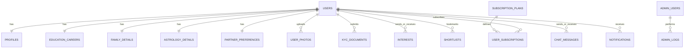

# 🗄️ Module 02: Relational Database Schema Specification

## 📌 Database Overview
- **Database Engine**: MySQL 8.0+ / MariaDB 10.5+
- **Default Collation**: `utf8mb4_unicode_ci` (Full Unicode & Indian language support)
- **Engine Type**: `InnoDB` (ACID compliance & Foreign Key constraints)
- **Key Identifiers**: Standard numeric auto-increment primary keys paired with a unique public `matrimony_id` (e.g., `DM10204`) for high-trust user reference.

---

## 🗺️ Entity Relationship (ER) Diagram



---

## 📋 Comprehensive Table Definitions (DDL)

### 1. `users` (Core Account Credentials & Status)
```sql
CREATE TABLE `users` (
  `id` BIGINT UNSIGNED AUTO_INCREMENT PRIMARY KEY,
  `matrimony_id` VARCHAR(20) NOT NULL UNIQUE COMMENT 'Public ID like DM10024',
  `email` VARCHAR(150) NOT NULL UNIQUE,
  `phone` VARCHAR(20) NOT NULL UNIQUE,
  `password_hash` VARCHAR(255) NOT NULL,
  `role` ENUM('super_admin', 'admin', 'moderator', 'user') NOT NULL DEFAULT 'user',
  `profile_for` ENUM('myself', 'son', 'daughter', 'brother', 'sister', 'relative', 'friend') NOT NULL DEFAULT 'myself',
  `status` ENUM('pending', 'active', 'suspended', 'banned') NOT NULL DEFAULT 'active',
  `is_kyc_verified` TINYINT(1) NOT NULL DEFAULT 0,
  `is_vip` TINYINT(1) NOT NULL DEFAULT 0,
  `email_verified_at` TIMESTAMP NULL DEFAULT NULL,
  `phone_verified_at` TIMESTAMP NULL DEFAULT NULL,
  `last_login_at` TIMESTAMP NULL DEFAULT NULL,
  `last_login_ip` VARCHAR(45) NULL,
  `created_at` TIMESTAMP DEFAULT CURRENT_TIMESTAMP,
  `updated_at` TIMESTAMP DEFAULT CURRENT_TIMESTAMP ON UPDATE CURRENT_TIMESTAMP,
  INDEX `idx_users_role_status` (`role`, `status`),
  INDEX `idx_users_matrimony_id` (`matrimony_id`)
) ENGINE=InnoDB DEFAULT CHARSET=utf8mb4 COLLATE=utf8mb4_unicode_ci;
```

---

### 2. `profiles` (Personal & Physical Information)
```sql
CREATE TABLE `profiles` (
  `id` BIGINT UNSIGNED AUTO_INCREMENT PRIMARY KEY,
  `user_id` BIGINT UNSIGNED NOT NULL UNIQUE,
  `first_name` VARCHAR(60) NOT NULL,
  `last_name` VARCHAR(60) NOT NULL,
  `gender` ENUM('male', 'female') NOT NULL,
  `dob` DATE NOT NULL,
  `marital_status` ENUM('never_married', 'divorced', 'widowed', 'separated') NOT NULL DEFAULT 'never_married',
  `mother_tongue` VARCHAR(50) NOT NULL DEFAULT 'Hindi',
  `height_cm` SMALLINT UNSIGNED NOT NULL COMMENT 'Height in centimeters',
  `weight_kg` SMALLINT UNSIGNED NULL,
  `blood_group` VARCHAR(10) NULL,
  `body_type` ENUM('slim', 'athletic', 'average', 'heavy') DEFAULT 'average',
  `complexion` ENUM('very_fair', 'fair', 'wheatish', 'dark') DEFAULT 'fair',
  `physical_status` ENUM('normal', 'physically_challenged') DEFAULT 'normal',
  `eating_habits` ENUM('vegetarian', 'non_vegetarian', 'eggetarian', 'jain') DEFAULT 'vegetarian',
  `drinking_habits` ENUM('no', 'occasionally', 'yes') DEFAULT 'no',
  `smoking_habits` ENUM('no', 'occasionally', 'yes') DEFAULT 'no',
  `about_me` TEXT NULL,
  `current_city` VARCHAR(80) NOT NULL,
  `current_state` VARCHAR(80) NOT NULL,
  `current_country` VARCHAR(80) NOT NULL DEFAULT 'India',
  `created_at` TIMESTAMP DEFAULT CURRENT_TIMESTAMP,
  `updated_at` TIMESTAMP DEFAULT CURRENT_TIMESTAMP ON UPDATE CURRENT_TIMESTAMP,
  FOREIGN KEY (`user_id`) REFERENCES `users`(`id`) ON DELETE CASCADE
) ENGINE=InnoDB DEFAULT CHARSET=utf8mb4 COLLATE=utf8mb4_unicode_ci;
```

---

### 3. `education_careers` (Professional Qualifications)
```sql
CREATE TABLE `education_careers` (
  `id` BIGINT UNSIGNED AUTO_INCREMENT PRIMARY KEY,
  `user_id` BIGINT UNSIGNED NOT NULL UNIQUE,
  `highest_education` VARCHAR(100) NOT NULL,
  `degree_details` VARCHAR(150) NULL,
  `college_university` VARCHAR(180) NULL,
  `employed_in` ENUM('private_sector', 'government_psu', 'defense', 'business_self_employed', 'not_working') NOT NULL,
  `occupation` VARCHAR(100) NOT NULL,
  `organization_name` VARCHAR(150) NULL,
  `annual_income_inr` BIGINT UNSIGNED NOT NULL COMMENT 'Annual Income in INR (LPA representation)',
  `work_city` VARCHAR(80) NOT NULL,
  `work_country` VARCHAR(80) NOT NULL DEFAULT 'India',
  FOREIGN KEY (`user_id`) REFERENCES `users`(`id`) ON DELETE CASCADE
) ENGINE=InnoDB DEFAULT CHARSET=utf8mb4 COLLATE=utf8mb4_unicode_ci;
```

---

### 4. `family_details` (Family Background & Cultural Heritage)
```sql
CREATE TABLE `family_details` (
  `id` BIGINT UNSIGNED AUTO_INCREMENT PRIMARY KEY,
  `user_id` BIGINT UNSIGNED NOT NULL UNIQUE,
  `father_name` VARCHAR(100) NULL,
  `father_status` ENUM('alive', 'deceased') DEFAULT 'alive',
  `father_occupation` VARCHAR(120) NULL,
  `mother_name` VARCHAR(100) NULL,
  `mother_status` ENUM('alive', 'deceased') DEFAULT 'alive',
  `mother_occupation` VARCHAR(120) NULL,
  `brothers_count` TINYINT UNSIGNED DEFAULT 0,
  `brothers_married` TINYINT UNSIGNED DEFAULT 0,
  `sisters_count` TINYINT UNSIGNED DEFAULT 0,
  `sisters_married` TINYINT UNSIGNED DEFAULT 0,
  `family_type` ENUM('joint', 'nuclear') DEFAULT 'nuclear',
  `family_values` ENUM('traditional', 'moderate', 'liberal') DEFAULT 'moderate',
  `family_status` ENUM('middle_class', 'upper_middle_class', 'rich', 'affluent') DEFAULT 'upper_middle_class',
  `native_city` VARCHAR(80) NULL,
  `native_state` VARCHAR(80) NULL,
  `about_family` TEXT NULL,
  FOREIGN KEY (`user_id`) REFERENCES `users`(`id`) ON DELETE CASCADE
) ENGINE=InnoDB DEFAULT CHARSET=utf8mb4 COLLATE=utf8mb4_unicode_ci;
```

---

### 5. `astrology_details` (Kundali, Gotra & Astro Traits)
```sql
CREATE TABLE `astrology_details` (
  `id` BIGINT UNSIGNED AUTO_INCREMENT PRIMARY KEY,
  `user_id` BIGINT UNSIGNED NOT NULL UNIQUE,
  `religion` VARCHAR(50) NOT NULL DEFAULT 'Hindu',
  `caste` VARCHAR(80) NOT NULL,
  `sub_caste` VARCHAR(80) NULL,
  `gotra` VARCHAR(80) NULL,
  `rashi` VARCHAR(50) NULL COMMENT 'Zodiac Sign',
  `nakshatra` VARCHAR(50) NULL COMMENT 'Birth Star',
  `manglik` ENUM('no', 'yes', 'anshik', 'dont_know') NOT NULL DEFAULT 'no',
  `birth_time` TIME NULL,
  `birth_city` VARCHAR(80) NULL,
  `kundali_chart_file` VARCHAR(255) NULL,
  FOREIGN KEY (`user_id`) REFERENCES `users`(`id`) ON DELETE CASCADE
) ENGINE=InnoDB DEFAULT CHARSET=utf8mb4 COLLATE=utf8mb4_unicode_ci;
```

---

### 6. `partner_preferences` (Match Filtering Expectations)
```sql
CREATE TABLE `partner_preferences` (
  `id` BIGINT UNSIGNED AUTO_INCREMENT PRIMARY KEY,
  `user_id` BIGINT UNSIGNED NOT NULL UNIQUE,
  `min_age` TINYINT UNSIGNED NOT NULL DEFAULT 21,
  `max_age` TINYINT UNSIGNED NOT NULL DEFAULT 35,
  `min_height_cm` SMALLINT UNSIGNED NOT NULL DEFAULT 150,
  `max_height_cm` SMALLINT UNSIGNED NOT NULL DEFAULT 190,
  `marital_status` VARCHAR(255) DEFAULT 'never_married' COMMENT 'Comma-separated values',
  `religion` VARCHAR(100) DEFAULT 'Hindu',
  `caste` VARCHAR(255) NULL COMMENT 'Preferred caste or Any',
  `manglik` ENUM('no', 'yes', 'doesnt_matter') DEFAULT 'doesnt_matter',
  `min_education` VARCHAR(100) NULL,
  `employed_in` VARCHAR(255) NULL,
  `min_annual_income_inr` BIGINT UNSIGNED DEFAULT 0,
  `preferred_state` VARCHAR(255) NULL,
  `preferred_city` VARCHAR(255) NULL,
  FOREIGN KEY (`user_id`) REFERENCES `users`(`id`) ON DELETE CASCADE
) ENGINE=InnoDB DEFAULT CHARSET=utf8mb4 COLLATE=utf8mb4_unicode_ci;
```

---

### 7. `user_photos` (Photo Gallery & Admin Moderation)
```sql
CREATE TABLE `user_photos` (
  `id` BIGINT UNSIGNED AUTO_INCREMENT PRIMARY KEY,
  `user_id` BIGINT UNSIGNED NOT NULL,
  `file_path` VARCHAR(255) NOT NULL,
  `is_profile_picture` TINYINT(1) NOT NULL DEFAULT 0,
  `is_private` TINYINT(1) NOT NULL DEFAULT 0,
  `is_approved` ENUM('pending', 'approved', 'rejected') NOT NULL DEFAULT 'approved',
  `rejection_reason` VARCHAR(255) NULL,
  `created_at` TIMESTAMP DEFAULT CURRENT_TIMESTAMP,
  FOREIGN KEY (`user_id`) REFERENCES `users`(`id`) ON DELETE CASCADE,
  INDEX `idx_photos_user_approved` (`user_id`, `is_approved`)
) ENGINE=InnoDB DEFAULT CHARSET=utf8mb4 COLLATE=utf8mb4_unicode_ci;
```

---

### 8. `kyc_documents` (Identity Proof Verification)
```sql
CREATE TABLE `kyc_documents` (
  `id` BIGINT UNSIGNED AUTO_INCREMENT PRIMARY KEY,
  `user_id` BIGINT UNSIGNED NOT NULL,
  `doc_type` ENUM('aadhaar', 'pan_card', 'passport', 'voter_id', 'driving_license') NOT NULL,
  `doc_number_masked` VARCHAR(50) NOT NULL COMMENT 'e.g. XXXX-XXXX-4589',
  `file_front` VARCHAR(255) NOT NULL,
  `file_back` VARCHAR(255) NULL,
  `status` ENUM('pending', 'approved', 'rejected') NOT NULL DEFAULT 'pending',
  `rejection_reason` TEXT NULL,
  `verified_by` BIGINT UNSIGNED NULL,
  `verified_at` TIMESTAMP NULL DEFAULT NULL,
  `created_at` TIMESTAMP DEFAULT CURRENT_TIMESTAMP,
  FOREIGN KEY (`user_id`) REFERENCES `users`(`id`) ON DELETE CASCADE
) ENGINE=InnoDB DEFAULT CHARSET=utf8mb4 COLLATE=utf8mb4_unicode_ci;
```

---

### 9. `subscription_plans` (Tiered Monetization Catalog)
```sql
CREATE TABLE `subscription_plans` (
  `id` INT UNSIGNED AUTO_INCREMENT PRIMARY KEY,
  `plan_code` VARCHAR(30) NOT NULL UNIQUE COMMENT 'FREE, GOLD, VIP_PRO',
  `title` VARCHAR(100) NOT NULL,
  `price_inr` DECIMAL(10,2) NOT NULL DEFAULT 0.00,
  `duration_days` INT UNSIGNED NOT NULL DEFAULT 30,
  `contact_views_limit` INT NOT NULL DEFAULT 10,
  `direct_messages_limit` INT NOT NULL DEFAULT 50,
  `priority_search_boost` TINYINT(1) NOT NULL DEFAULT 0,
  `kundali_matching_unlimited` TINYINT(1) NOT NULL DEFAULT 0,
  `badge_name` VARCHAR(50) NOT NULL DEFAULT 'Member',
  `is_active` TINYINT(1) NOT NULL DEFAULT 1,
  `created_at` TIMESTAMP DEFAULT CURRENT_TIMESTAMP
) ENGINE=InnoDB DEFAULT CHARSET=utf8mb4 COLLATE=utf8mb4_unicode_ci;
```

---

### 10. `user_subscriptions` (Active Plan Grants & Invoices)
```sql
CREATE TABLE `user_subscriptions` (
  `id` BIGINT UNSIGNED AUTO_INCREMENT PRIMARY KEY,
  `user_id` BIGINT UNSIGNED NOT NULL,
  `plan_id` INT UNSIGNED NOT NULL,
  `starts_at` TIMESTAMP NOT NULL DEFAULT CURRENT_TIMESTAMP,
  `expires_at` TIMESTAMP NOT NULL,
  `contacts_viewed_count` INT UNSIGNED NOT NULL DEFAULT 0,
  `messages_sent_count` INT UNSIGNED NOT NULL DEFAULT 0,
  `is_free_grant` TINYINT(1) NOT NULL DEFAULT 0 COMMENT 'Granted for free by Admin or Launch Promo',
  `granted_by_admin_id` BIGINT UNSIGNED NULL,
  `grant_notes` VARCHAR(255) NULL,
  `status` ENUM('active', 'expired', 'revoked') NOT NULL DEFAULT 'active',
  `created_at` TIMESTAMP DEFAULT CURRENT_TIMESTAMP,
  FOREIGN KEY (`user_id`) REFERENCES `users`(`id`) ON DELETE CASCADE,
  FOREIGN KEY (`plan_id`) REFERENCES `subscription_plans`(`id`),
  INDEX `idx_sub_user_status` (`user_id`, `status`)
) ENGINE=InnoDB DEFAULT CHARSET=utf8mb4 COLLATE=utf8mb4_unicode_ci;
```

---

### 11. `interests` (Express Interest / Connect Requests)
```sql
CREATE TABLE `interests` (
  `id` BIGINT UNSIGNED AUTO_INCREMENT PRIMARY KEY,
  `sender_id` BIGINT UNSIGNED NOT NULL,
  `receiver_id` BIGINT UNSIGNED NOT NULL,
  `status` ENUM('pending', 'accepted', 'declined', 'cancelled') NOT NULL DEFAULT 'pending',
  `created_at` TIMESTAMP DEFAULT CURRENT_TIMESTAMP,
  `updated_at` TIMESTAMP DEFAULT CURRENT_TIMESTAMP ON UPDATE CURRENT_TIMESTAMP,
  UNIQUE KEY `unique_interest_pair` (`sender_id`, `receiver_id`),
  FOREIGN KEY (`sender_id`) REFERENCES `users`(`id`) ON DELETE CASCADE,
  FOREIGN KEY (`receiver_id`) REFERENCES `users`(`id`) ON DELETE CASCADE
) ENGINE=InnoDB DEFAULT CHARSET=utf8mb4 COLLATE=utf8mb4_unicode_ci;
```

---

### 12. `shortlists` (Saved Profiles)
```sql
CREATE TABLE `shortlists` (
  `id` BIGINT UNSIGNED AUTO_INCREMENT PRIMARY KEY,
  `user_id` BIGINT UNSIGNED NOT NULL,
  `saved_user_id` BIGINT UNSIGNED NOT NULL,
  `created_at` TIMESTAMP DEFAULT CURRENT_TIMESTAMP,
  UNIQUE KEY `unique_user_shortlist` (`user_id`, `saved_user_id`),
  FOREIGN KEY (`user_id`) REFERENCES `users`(`id`) ON DELETE CASCADE,
  FOREIGN KEY (`saved_user_id`) REFERENCES `users`(`id`) ON DELETE CASCADE
) ENGINE=InnoDB DEFAULT CHARSET=utf8mb4 COLLATE=utf8mb4_unicode_ci;
```

---

### 13. `chat_messages` (In-App Direct Chat)
```sql
CREATE TABLE `chat_messages` (
  `id` BIGINT UNSIGNED AUTO_INCREMENT PRIMARY KEY,
  `sender_id` BIGINT UNSIGNED NOT NULL,
  `receiver_id` BIGINT UNSIGNED NOT NULL,
  `message` TEXT NOT NULL,
  `is_read` TINYINT(1) NOT NULL DEFAULT 0,
  `read_at` TIMESTAMP NULL DEFAULT NULL,
  `created_at` TIMESTAMP DEFAULT CURRENT_TIMESTAMP,
  FOREIGN KEY (`sender_id`) REFERENCES `users`(`id`) ON DELETE CASCADE,
  FOREIGN KEY (`receiver_id`) REFERENCES `users`(`id`) ON DELETE CASCADE,
  INDEX `idx_chat_pair` (`sender_id`, `receiver_id`, `created_at`)
) ENGINE=InnoDB DEFAULT CHARSET=utf8mb4 COLLATE=utf8mb4_unicode_ci;
```

---

### 14. `notifications` (In-App Activity & Alert Feed)
```sql
CREATE TABLE `notifications` (
  `id` BIGINT UNSIGNED AUTO_INCREMENT PRIMARY KEY,
  `user_id` BIGINT UNSIGNED NOT NULL,
  `type` ENUM('interest', 'interest_accepted', 'message', 'match', 'plan', 'kyc', 'admin_alert') NOT NULL,
  `title` VARCHAR(150) NOT NULL,
  `message` TEXT NOT NULL,
  `action_url` VARCHAR(255) NULL,
  `is_read` TINYINT(1) NOT NULL DEFAULT 0,
  `created_at` TIMESTAMP DEFAULT CURRENT_TIMESTAMP,
  FOREIGN KEY (`user_id`) REFERENCES `users`(`id`) ON DELETE CASCADE,
  INDEX `idx_user_unread` (`user_id`, `is_read`)
) ENGINE=InnoDB DEFAULT CHARSET=utf8mb4 COLLATE=utf8mb4_unicode_ci;
```

---

### 15. `admin_logs` (Security & Audit Trail)
```sql
CREATE TABLE `admin_logs` (
  `id` BIGINT UNSIGNED AUTO_INCREMENT PRIMARY KEY,
  `admin_id` BIGINT UNSIGNED NOT NULL,
  `action` VARCHAR(100) NOT NULL COMMENT 'e.g. GRANT_VIP, BAN_USER, APPROVE_KYC',
  `target_entity` VARCHAR(50) NOT NULL COMMENT 'users, kyc, subscriptions',
  `target_id` BIGINT UNSIGNED NULL,
  `ip_address` VARCHAR(45) NOT NULL,
  `user_agent` TEXT NULL,
  `details_json` JSON NULL,
  `created_at` TIMESTAMP DEFAULT CURRENT_TIMESTAMP,
  FOREIGN KEY (`admin_id`) REFERENCES `users`(`id`),
  INDEX `idx_admin_action` (`admin_id`, `action`, `created_at`)
) ENGINE=InnoDB DEFAULT CHARSET=utf8mb4 COLLATE=utf8mb4_unicode_ci;
```

---

### 16. `blocked_ips` (Firewall Blacklist)
```sql
CREATE TABLE `blocked_ips` (
  `id` INT UNSIGNED AUTO_INCREMENT PRIMARY KEY,
  `ip_address` VARCHAR(45) NOT NULL UNIQUE,
  `reason` VARCHAR(255) NOT NULL,
  `blocked_by` BIGINT UNSIGNED NULL,
  `blocked_until` TIMESTAMP NULL DEFAULT NULL COMMENT 'NULL means permanent',
  `created_at` TIMESTAMP DEFAULT CURRENT_TIMESTAMP
) ENGINE=InnoDB DEFAULT CHARSET=utf8mb4 COLLATE=utf8mb4_unicode_ci;
```

---

### 17. `promotions` (Banners & Launch Specials)
```sql
CREATE TABLE `promotions` (
  `id` INT UNSIGNED AUTO_INCREMENT PRIMARY KEY,
  `title` VARCHAR(150) NOT NULL,
  `banner_image` VARCHAR(255) NULL,
  `badge_text` VARCHAR(50) DEFAULT 'LAUNCH OFFER',
  `description` TEXT NULL,
  `coupon_code` VARCHAR(30) NULL,
  `action_link` VARCHAR(255) NULL,
  `is_active` TINYINT(1) NOT NULL DEFAULT 1,
  `starts_at` TIMESTAMP NULL DEFAULT NULL,
  `expires_at` TIMESTAMP NULL DEFAULT NULL,
  `created_at` TIMESTAMP DEFAULT CURRENT_TIMESTAMP
) ENGINE=InnoDB DEFAULT CHARSET=utf8mb4 COLLATE=utf8mb4_unicode_ci;
```

---

### 18. `app_settings` (Dynamic Global Configuration)
```sql
CREATE TABLE `app_settings` (
  `id` INT UNSIGNED AUTO_INCREMENT PRIMARY KEY,
  `setting_key` VARCHAR(80) NOT NULL UNIQUE,
  `setting_value` TEXT NULL,
  `setting_group` VARCHAR(50) NOT NULL DEFAULT 'general',
  `description` VARCHAR(255) NULL,
  `updated_at` TIMESTAMP DEFAULT CURRENT_TIMESTAMP ON UPDATE CURRENT_TIMESTAMP
) ENGINE=InnoDB DEFAULT CHARSET=utf8mb4 COLLATE=utf8mb4_unicode_ci;
```

---

## 💎 Initial Data Fixtures & Seeds

```sql
-- 1. Insert Default Subscription Plans (with Launch Free VIP)
INSERT INTO `subscription_plans` (`plan_code`, `title`, `price_inr`, `duration_days`, `contact_views_limit`, `direct_messages_limit`, `priority_search_boost`, `kundali_matching_unlimited`, `badge_name`, `is_active`) VALUES
('FREE_BASIC', 'Free Member', 0.00, 365, 3, 10, 0, 0, 'Basic', 1),
('GOLD_PREMIUM', 'Gold Match', 2499.00, 90, 50, 200, 1, 1, 'Gold', 1),
('VIP_PRO', 'Dheeraja Royal VIP Pro', 4999.00, 180, 200, 1000, 1, 1, 'Royal VIP', 1);

-- 2. Insert Core App Settings (Including Launch VIP Promotion Mode)
INSERT INTO `app_settings` (`setting_key`, `setting_value`, `setting_group`, `description`) VALUES
('site_name', 'Dheeraja Matrimony', 'general', 'Platform Brand Name'),
('support_email', 'support@dheerajamatrimony.com', 'general', 'Customer Support Email'),
('alert_admin_email', 'admin@dheerajamatrimony.com', 'mail', 'Email receiving critical admin alerts'),
('smtp_host', 'smtp.gmail.com', 'mail', 'Gmail SMTP Host'),
('smtp_port', '587', 'mail', 'Gmail SMTP Port (TLS)'),
('smtp_username', '', 'mail', 'Gmail Account Email Address'),
('smtp_password', '', 'mail', 'Gmail 16-character App Password'),
('smtp_from_name', 'Dheeraja Matrimony Alerts', 'mail', 'Outgoing Email Sender Name'),
('launch_free_vip_enabled', '1', 'promotion', 'Automatically grants free VIP Pro plan to all new signups during initial launch'),
('launch_free_vip_days', '90', 'promotion', 'Duration in days for free launch VIP plan'),
('admin_session_timeout_minutes', '15', 'security', 'Minutes of inactivity before auto-locking Admin session');
```
