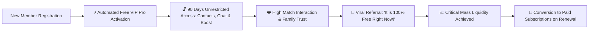

# 🚀 Module 07: Launch Promotion & Monetization Engine

## 📌 Business Strategy: The Early Bird Free VIP Flywheel

The biggest hurdle for any matrimonial startup is **liquidity**—having enough high-quality, verified profiles so every registrant finds genuine matches immediately.

To guarantee rapid organic growth and viral word-of-mouth adoption, Dheeraja Matrimony adopts an **Aggressive Early-Bird Free VIP Strategy**:



---

## 💎 Launch Tier Specification: "Royal VIP Pro (Launch Special)"

| Capability | Standard Free Plan (Post-Launch) | Early Bird Launch VIP (Current) | Standard Paid VIP Pro (Future) |
| :--- | :--- | :--- | :--- |
| **Price** | ₹0 | **₹0 (100% Complimentary)** | ₹4,999 / 6 Months |
| **Validity** | 30 Days | **90 Days (Extendable by Admin)** | 180 Days |
| **Contact / Phone Views** | 3 Profiles | **200 Profiles** | 300 Profiles |
| **Direct In-App Chat** | Locked | **Unlimited Real-Time Chat** | Unlimited |
| **VIP Golden Badge** | ❌ No | **⭐ Glowing Royal VIP Badge** | ⭐ Glowing Royal VIP Badge |
| **Search Boost** | Normal | **Top 5% Priority Placement** | Top 5% Priority Placement |
| **Kundali Gun Milan** | 1 per day | **Unlimited Matching** | Unlimited Matching |
| **Profile Viewed Alerts** | Weekly | **Instant Real-Time Alerts** | Instant Real-Time Alerts |

---

## 🎛️ Master Admin Control Over Launch Privileges

The Master Administrator retains total control over this promotion via the Admin Panel:

1. **Global Promotion Master Switch (`app_settings`)**:
   - `launch_free_vip_enabled`: `1` (Active) or `0` (Disabled).
   - Once disabled, new signups automatically fall back to the restricted `FREE_BASIC` plan.
2. **Dynamic Duration Configuration**:
   - Easily modify the free period from 90 days to 30, 60, or 180 days without touching source code.
3. **Targeted One-Click Grant & Revocation**:
   - Admin can extend any specific user's VIP by +30, +60, or +365 days from `views/admin/users/grant-vip.php`.
   - Admin can instantly revoke VIP privileges if a profile exhibits abusive behavior.
4. **Manual VIP Grant for Community Influencers & Elders**:
   - Special "Lifetime Free VIP" toggle for community ambassadors and high-profile offline entries.

---

## 📣 In-App Promotion Banners & Viral Triggers

### 1. Header Sticky Ribbon
```html
<div class="bg-gradient-to-r from-maroon-700 via-gold-500 to-maroon-700 text-pearl py-2 px-4 text-center text-sm font-semibold tracking-wide shadow-md">
  🎉 Exclusive Launch Celebration: 90 Days Royal VIP Pro is FREE for Early Members! 
  <span class="underline ml-2 cursor-pointer">View Your Unlocked Perks ✨</span>
</div>
```

### 2. Social Proof & Urgency Bar
- "👑 *Over 850 families claimed Free VIP this week. Limited launch spots remaining.*"
- Dynamic countdown progress bar: `85% of Early Bird VIP Slots Claimed`.

---

## 🔄 Post-Launch Conversion & Monetization Funnel

When the 90-day complimentary period nears its end, the system automatically runs an automated nurture sequence via PHPMailer:

1. **Day 75 (15 Days Left)**:
   - **Trigger**: Automated email & in-app reminder.
   - **Message**: "You have found 18 matches and viewed 42 contacts on Dheeraja! Your VIP status has 15 days remaining."
2. **Day 85 (5 Days Left)**:
   - **Trigger**: Special Early Renewal Offer.
   - **Incentive**: 50% discount coupon (`RENEW50`) to lock in 1 full year of Royal VIP for just ₹1,999.
3. **Day 90 (Expiration)**:
   - Graceful transition to `FREE_BASIC` tier. Existing connections and chat history remain preserved; only new contact reveals require renewal.
